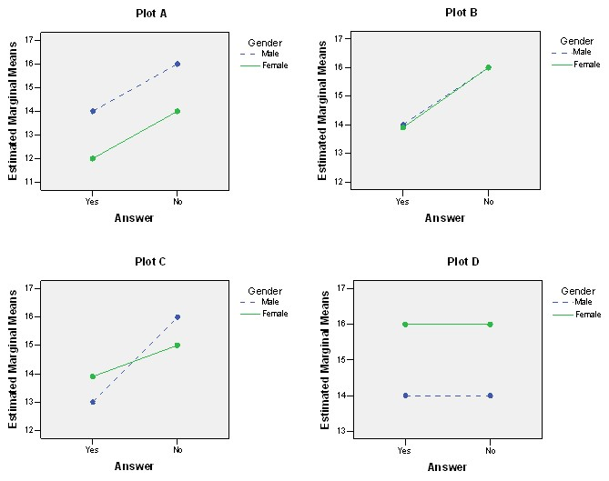

```{r, echo = FALSE, results = "hide"}
include_supplement("uu-Twoway-ANOVA-838-nl-tabel.jpg", recursive = TRUE)
```

Question
========
  
The four graphs below are interaction diagrams belonging to a two-way ANOVA comparing results between men and women (Gender: Male/Female) and between response to a question about relationship problems (Answer: Yes/No). Which of the four graphs show a main effect for one factor but not the other?


  
Answerlist
----------
* Graph A and graph B
* Graph A and graph D
* Graph B, graph C and graph D
* All four graphs


Solution
========

Meta-information
================
exname: uu-Twoway-ANOVA-838-en
extype: schoice
exsolution: 0010
exsection: Inferential Statistics/Parametric Techniques/ANOVA/Twoway ANOVA
exextra[Type]: Interpretating output
exextra[Program]: SPSS
exextra[Language]: English
exextra[Level]: Statistical Literacy
