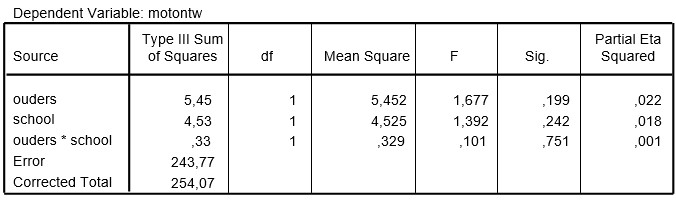

```{r, echo = FALSE, results = "hide"}
include_supplement("uu-Twoway-ANOVA-839-nl-tabel.jpg", recursive = TRUE)
```

Question
========
  
Research shows that deaf children of deaf parents perform better linguistically and socially. They also score higher academically than deaf children of hearing parents. Researchers K.L. Hamminga, S. de Vries and J.C. Walsen investigated among 79 deaf children whether this was also the case for motor development. Moreover, a distinction was made between deaf children who attended a regular school and deaf children who attended special (deaf) education. Subjects were drawn at random from the population of deaf children (6 to 18 years of age) in the Netherlands, and tested for motor development. This was done by means of a dozen tests such as running, hopping, jumping, catching, etc., which were recorded with a camera. A certain criterion was set for each act for each age, based on standard norms. When watching the videos, each child was given a point when he or she met the criterion for a particular act, and thus could score a minimum of 0 and a maximum of 12 points. The researchers conducted a two-way ANOVA.


The researchers conducted a two-way ANOVA, the SPSS output of which is below.




What is the correct conclusion of the above ANOVA at $\alpha$ = .05? 
Answerlist
----------
* Both main effect and the interaction effect are significant.
* Both main effects are significant, but the interaction effect is not significant.
* Both main effects are not significant, but the interaction effect is significant.
* Both main effects and the interaction effect are not significant.


Solution
========

Meta-information
================
exname: uu-Twoway-ANOVA-839-en
extype: schoice
exsolution: 0001
exsection: Inferential Statistics/Parametric Techniques/ANOVA/Twoway ANOVA
exextra[ID]: 1ca4d
exextra[Type]: Interpretating output
exextra[Program]: SPSS
exextra[Language]: English
exextra[Level]: Statistical Literacy
