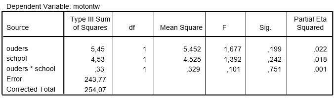

```{r, echo = FALSE, results = "hide"}
include_supplement("uu-Twoway-ANOVA-839-nl-tabel.jpg", recursive = TRUE)
```


Question
========
  
Uit onderzoek blijkt dat dove kinderen van dove ouders beter functioneren op het gebied van taal en op sociaal gebied. Ook academisch gezien scoren ze hoger dan dove kinderen van horende ouders. De onderzoeker K.L. Hamminga, S. de Vries en J.C. Walsen onderzochten bij 79 dove kinderen of dit ook het geval was voor de motorische ontwikkeling. Hierbij werd bovendien onderscheid gemaakt tussen dove kinderen die op een reguliere school zaten en dove kinderen die naar speciaal (doven)onderwijs gingen. 
De proefpersonen werden at random uit de populatie van dove kinderen (6 tot en met 18 jaar) in Nederland getrokken, en getest op motorische ontwikkeling. Dit gebeurde aan de hand van een twaalf testjes zoals rennen, huppelen, springen, vangen ed. die met een camera werden opgenomen. Voor elke handeling is voor elke leeftijd een bepaald criterium vastgesteld, gebaseerd op standaard normen. Bij het bekijken van de video’s kreeg elk kind een punt wanneer het aan het criterium van een bepaalde handeling had voldaan, en kon dus minimaal 0 en maximaal 12 punten scoren. De onderzoekers voerden een tweeweg ANOVA uit. 


De onderzoekers voerden een tweeweg ANOVA uit, waarvan de SPSS-output hieronder staat.




Wat is de juiste conclusie van bovenstaande ANOVA bij $\alpha$ = .05?
  
Answerlist
----------
* Beide hoofdeffecten en het interactie-effect zijn significant.
* Beide hoofdeffecten zijn significant, maar het interactie-effect is niet significant.
* Beide hoofdeffecten zijn niet significant, maar het interactie-effect is wel significant.
* Zowel de hoofdeffecten als het interactie-effect zijn niet significant.


Solution
========


Meta-information
================
exname: uu-Twoway-ANOVA-839-nl.Rmd
extype: schoice
exsolution: 0001
exsection: Inferential Statistics/Parametric Techniques/ANOVA/Twoway ANOVA
exextra[ID]: 27355
exextra[Type]: Interpretating output
exextra[Program]: SPSS
exextra[Language]: Dutch
exextra[Level]: Statistical Literacy
