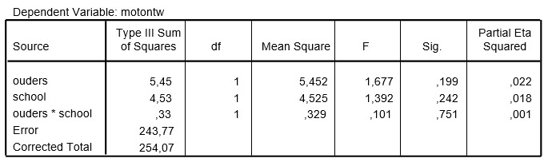

```{r, echo = FALSE, results = "hide"}
include_supplement("uu-Twoway-ANOVA-840-nl-tabel.jpg", recursive = TRUE)
```


Question
========
  
Uit onderzoek blijkt dat dove kinderen van dove ouders beter functioneren op het gebied van taal en op sociaal gebied. Ook academisch gezien scoren ze hoger dan dove kinderen van horende ouders. De onderzoeker K.L. Hamminga, S. de Vries en J.C. Walsen onderzochten bij 79 dove kinderen of dit ook het geval was voor de motorische ontwikkeling. Hierbij werd bovendien onderscheid gemaakt tussen dove kinderen die op een reguliere school zaten en dove kinderen die naar speciaal (doven)onderwijs gingen. 
De proefpersonen werden at random uit de populatie van dove kinderen (6 tot en met 18 jaar) in Nederland getrokken, en getest op motorische ontwikkeling. Dit gebeurde aan de hand van een twaalf testjes zoals rennen, huppelen, springen, vangen ed. die met een camera werden opgenomen. Voor elke handeling is voor elke leeftijd een bepaald criterium vastgesteld, gebaseerd op standaard normen. Bij het bekijken van de video’s kreeg elk kind een punt wanneer het aan het criterium van een bepaalde handeling had voldaan, en kon dus minimaal 0 en maximaal 12 punten scoren. De onderzoekers voerden een tweeweg ANOVA uit. 


De onderzoekers voerden een tweeweg ANOVA uit, waarvan de SPSS-output hieronder staat.




In de bovenstaande ANOVA tabel ontbreekt de waarde van Mean Square Error. Wat is de correcte waarde hiervan?
  
Answerlist
----------
* 3.25 
* 3.13
* 0.31
* 243.77


Solution
========
  


Meta-information
================
exname: uu-Twoway-ANOVA-840-nl.Rmd
extype: schoice
exsolution: 1000
exsection: Inferential Statistics/Parametric Techniques/ANOVA/Twoway ANOVA
exextra[ID]: 1f7ee
exextra[Type]: Interpretating output
exextra[Program]: SPSS
exextra[Language]: Dutch
exextra[Level]: Statistical Literacy
