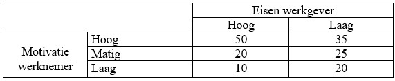

```{r, echo = FALSE, results = "hide"}
include_supplement("uu-Twoway-ANOVA-842-nl-tabel.jpg", recursive = TRUE)
```

Question
========
You decide to replicate a study. The table below shows your results. What type of effect is visible?



Answerlist
----------
* A main effect of motivation employee and an interaction effect.
* A main effect of requirements employer and an interaction effect.
* A main effect of both requirements employer and employee motivation and an interaction effect.
* A main effect of both requirements employer and motivation employee and no interaction effect.


Solution
========

Meta-information
================
exname: uu-Twoway-ANOVA-842-en
extype: schoice
exsolution: 1000
exsection: Inferential Statistics/Parametric Techniques/ANOVA/Twoway ANOVA
exextra[Type]: Interpretating graph
exextra[Program]: SPSS
exextra[Language]: English
exextra[Level]: Statistical Literacy