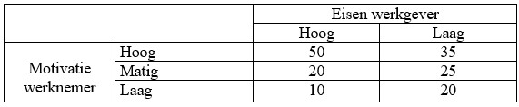

```{r, echo = FALSE, results = "hide"}
include_supplement("uu-Twoway-ANOVA-842-nl-tabel.jpg", recursive = TRUE)
```


Question
========
Jij besluit een onderzoek te repliceren. Onderstaande tabel geeft jouw resultaten weer. Welk soort effect is zichtbaar?



Answerlist
----------
* Een hoofdeffect van motivatie werknemer en een interactie-effect.
* Een hoofdeffect van eisen werkgever en een interactie-effect.
* Een hoofdeffect van zowel eisen werkgever als motivatie werknemer en een interactie-effect.
* Een hoofdeffect van zowel eisen werkgever als motivatie werknemer en geen interactie-effect.


Solution
========


Meta-information
================
exname: uu-Twoway-ANOVA-842-nl.Rmd
extype: schoice
exsolution: 1000
exsection: Inferential Statistics/Parametric Techniques/ANOVA/Twoway ANOVA
exextra[ID]: 00758
exextra[Type]: Interpretating graph
exextra[Program]: SPSS
exextra[Language]: Dutch
exextra[Level]: Statistical Literacy