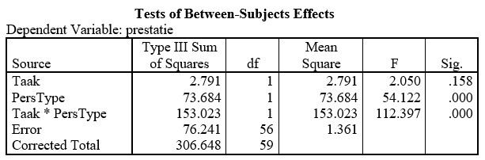

```{r, echo = FALSE, results = "hide"}
include_supplement("uu-Twoway-ANOVA-843-nl-tabel.jpg", recursive = TRUE)
```

Question
========
A year later, the experiment of Fazio et al. is conducted again. These are the results of the two-way Anova:



What is the result

Answerlist
----------
* There is only a main effect of task
* There is both a main effect of personality type, and an interaction effect
* There is only an interaction effect
* That cannot be determined based on the above information


Solution
========

Meta-information
================
exname: uu-Twoway-ANOVA-843-en
extype: schoice
exsolution: 0100
exsection: Inferential Statistics/Parametric Techniques/ANOVA/Twoway ANOVA
exextra[ID]: 542c5
exextra[Type]: Interpretating output
exextra[Program]: SPSS
exextra[Language]: English
exextra[Level]: Statistical Literacy