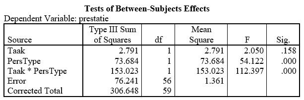

```{r, echo = FALSE, results = "hide"}
include_supplement("uu-Twoway-ANOVA-843-nl-tabel.jpg", recursive = TRUE)
```


Question
========
Een jaar later wordt het experiment van Fazio et al. nog een keer uitgevoerd. Dit zijn de resultaten van de twee-weg Anova:



Wat is het resultaat

Answerlist
----------
* Er is alleen een hoofdeffect van taak
* Er is zowel een hoofdeffect van persoonlijkheidstype, als een interactie-effect
* Er is alleen een interactie-effect
* Dat is op basis van bovenstaande informatie niet te bepalen


Solution
========


Meta-information
================
exname: uu-Twoway-ANOVA-843-nl.Rmd
extype: schoice
exsolution: 0100
exsection: Inferential Statistics/Parametric Techniques/ANOVA/Twoway ANOVA
exextra[Type]: Interpretating output
exextra[Program]: SPSS
exextra[Language]: Dutch
exextra[Level]: Statistical Literacy