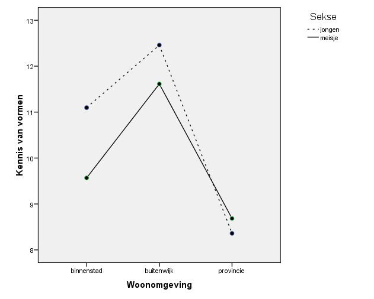

```{r, echo = FALSE, results = "hide"}
include_supplement("uu-Twoway-ANOVA-844-nl-tabel.jpg", recursive = TRUE)
```

Question
========
Using the data from the Sesame Street survey, a researcher conducted a two-way ANOVA for KNOWLEDGE OF FORMS with the factors LIVING ENVIRONMENT (1 = inner city, 2 = suburb, 3 = county) and SEKSE (1 = boy, 2 = girl).

Using the mean chart shown, evaluate the following two statements. Assume that any differences you see are significant. I. There is no main effect of SEKSE on KNOWLEDGE OF FORMS. II. The effect of SEKSE on KNOWLEDGE OF FORMS is greater for the downtown category than for the county category.




Answerlist
----------
* I is correct, II is correct.
* I is not correct, II is correct.
* I is correct, II is not correct.
* I is not correct, II is not correct.


Solution
========

Meta-information
================
exname: uu-Twoway-ANOVA-844-en
extype: schoice
exsolution: 0100
exsection: Inferential Statistics/Parametric Techniques/ANOVA/Twoway ANOVA
exextra[ID]: fd598
exextra[Type]: Interpretating output
exextra[Program]: SPSS
exextra[Language]: English
exextra[Level]: Statistical Literacy