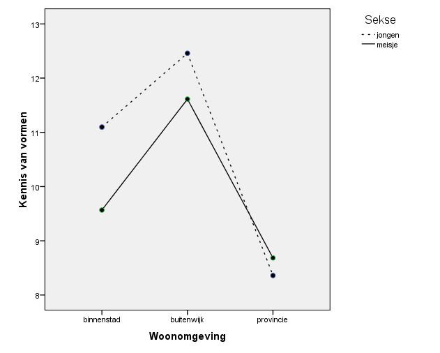

```{r, echo = FALSE, results = "hide"}
include_supplement("uu-Twoway-ANOVA-844-nl-tabel.jpg", recursive = TRUE)
```


Question
========
Met de gegevens uit het Sesamstraat-onderzoek heeft een onderzoeker een tweeweg-ANOVA uitgevoerd voor KENNIS VAN VORMEN met de factoren  WOONOMGEVING (1 = binnenstad, 2 = buitenwijk, 3 = provincie) en SEKSE (1 = jongen, 2 = meisje). 

Beoordeel met het getoonde gemiddeldendiagram de volgende twee uitspraken. Ga er van uit dat alle verschillen die je ziet, significant zijn.
I. Er is geen hoofdeffect van SEKSE op KENNIS VAN VORMEN.
II. Het effect van SEKSE op KENNIS VAN VORMEN is voor de categorie binnenstad groter dan voor de categorie provincie.




Answerlist
----------
* I is juist, II is juist.
* I is niet juist, II is juist.
* I is juist, II is niet juist.
* I is niet juist, II is niet juist.


Solution
========


Meta-information
================
exname: uu-Twoway-ANOVA-844-nl.Rmd
extype: schoice
exsolution: 0100
exsection: Inferential Statistics/Parametric Techniques/ANOVA/Twoway ANOVA
exextra[ID]: 6d6c5
exextra[Type]: Interpretating output
exextra[Program]: SPSS
exextra[Language]: Dutch
exextra[Level]: Statistical Literacy