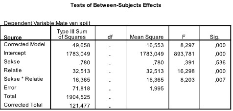
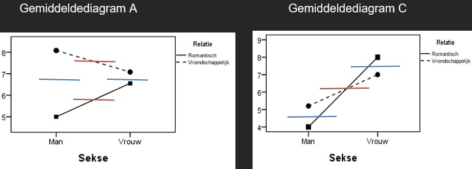

```{r, echo = FALSE, results = "hide"}
include_supplement("uu-Twoway-ANOVA-845-nl-graph01.jpg", recursive = TRUE)
```
```{r, echo = FALSE, results = "hide"}
include_supplement("uu-Twoway-ANOVA-845-nl-graph02.jpg", recursive = TRUE)
```
```{r, echo = FALSE, results = "hide"}
include_supplement("uu-Twoway-ANOVA-845-nl-graph03.jpg", recursive = TRUE)
```
Question
========
Researchers Teun and Jorden are investigating the degree of regret people experience about things people did not do within a romantic or friendly relationship. Twenty men completed a questionnaire for this purpose (10 regarding a romantic relationship, 10 regarding a friendly relationship), and twenty women completed the questionnaire (idem).

SPSS output is given below. 



Which of the interaction diagrams below best matches the results visible in the ANOVA table?


Answerlist
----------
* Diagram B
* Diagram C
* Diagram D
* Diagram A


Solution
========
The table shows that there is no main effect of Gender (p = .536). However, there is a main effect of relationship (p < .001) and also an interaction effect (p = .007). Mean diagrams B and D drop out immediately, here there is no interaction effect (the lines are parallel). In the remaining mean diagrams, it is necessary to examine which main effect is present. Below is that gained, blue represents the main effect of Gender. Red represents the main effect of Relationship. Recall that it is examined whether the lines are at the same height of the y-axis!



Judging from these lines, it can be concluded that in Average Diagram A, a main effect of Relationship is depicted. And in Average Diagram C, a main effect of Gender is depicted. For this reason, Average Diagram A is appropriate for the table.

Meta-information
================
exname: uu-Twoway-ANOVA-845-en
extype: schoice
exsolution: 0001
exsection: Inferential Statistics/Parametric Techniques/ANOVA/Twoway ANOVA
exextra[Type]: Interpretating graph, Interpretating output
exextra[Program]: SPSS
exextra[Language]: English
exextra[Level]: Statistical Reasoning