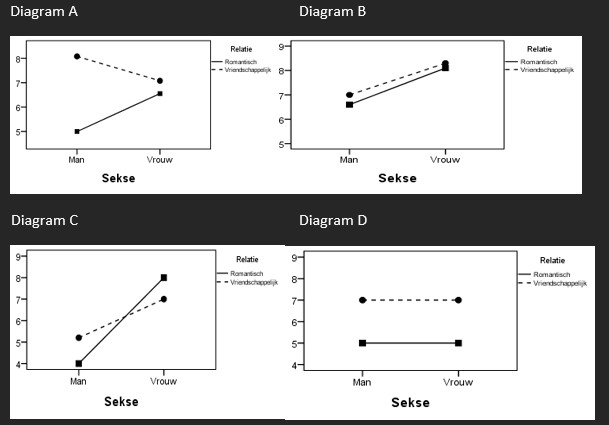

```{r, echo = FALSE, results = "hide"}
include_supplement("uu-Twoway-ANOVA-845-nl-graph01.jpg", recursive = TRUE)
```
```{r, echo = FALSE, results = "hide"}
include_supplement("uu-Twoway-ANOVA-845-nl-graph02.jpg", recursive = TRUE)
```
```{r, echo = FALSE, results = "hide"}
include_supplement("uu-Twoway-ANOVA-845-nl-graph03.jpg", recursive = TRUE)
```
Question
========
De onderzoekers Teun en Jorden doen onderzoek naar de mate van spijt die mensen ervaren over dingen die mensen niet gedaan hebben binnen een romantische of vriendschappelijke relatie. Twintig mannen hebben hiervoor een vragenlijst ingevuld (10 m.b.t. een romantische relatie, 10 m.b.t. een vriendschappelijke relatie), en twintig vrouwen hebben de vragenlijst ingevuld (idem). 

SPSS output staat hieronder gegeven. 


Welk van de onderstaande interactiediagrammen komt het best overeen met de resultaten die in de ANOVA tabel zichtbaar zijn?



Answerlist
----------
* Diagram B
* Diagram C
* Diagram D
* Diagram A


Solution
========
In de tabel is te zien dat er geen hoofdeffect is van Sekse (p = .536). Er is wel een hoofdeffect van relatie (p < .001) en ook een interactie-effect (p = .007).
De gemiddeldendiagrammen B en D vallen direct af, hier is geen interactie-effect te zien (de lijnen lopen parallel). In de overige gemiddeldediagrammen moet onderzocht worden welk hoofdeffect aanwezig is. Hieronder is dat voorgedaan, blauw staat voor het hoofdeffect van Sekse. Rood staat voor het hoofdeffect van Relatie. Bedenk dat er wordt gekeken of de strepen op dezelfde hoogte van de y-as staan!


Afgaande op deze lijnen, kan geconcludeerd worden dat er in Gemiddeldediagram A een hoofdeffect van Relatie afgebeeld wordt. En in Gemiddeldediagram C wordt een hoofdeffect van Sekse afgebeeld. Om die reden is Gemiddeldediagram A passend bij de tabel.


Meta-information
================
exname: uu-Twoway-ANOVA-845-nl.Rmd
extype: schoice
exsolution: 0001
exsection: Inferential Statistics/Parametric Techniques/ANOVA/Twoway ANOVA
exextra[Type]: Interpretating graph, Interpretating output
exextra[Program]: SPSS
exextra[Language]: Dutch
exextra[Level]: Statistical Reasoning