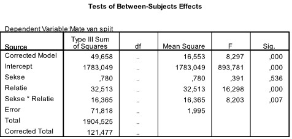
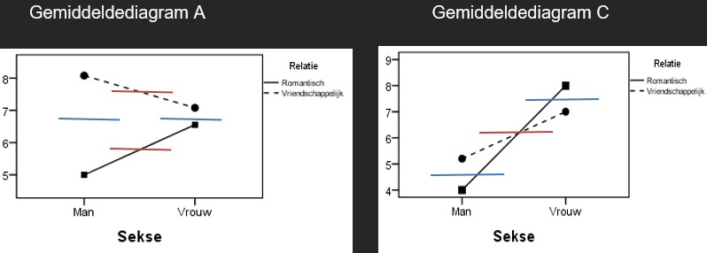

```{r, echo = FALSE, results = "hide"}
include_supplement("uu-Twoway-ANOVA-846-nl-graph01.jpg", recursive = TRUE)
```
```{r, echo = FALSE, results = "hide"}
include_supplement("uu-Twoway-ANOVA-846-nl-graph02.jpg", recursive = TRUE)
```
```{r, echo = FALSE, results = "hide"}
include_supplement("uu-Twoway-ANOVA-846-nl-graph03.jpg", recursive = TRUE)
```
Question
========
People differ in the extent to which they regret what they did not do within a relationship. In a survey with the factors GENDER (male or female) and type of RELATION (romantic or friendly), respondents were administered the "regret-about-what-I-didn't-do-in-my-relationship" test. The results of the statistical analysis of the data are shown in the table below.

Judging from the results in the SPSS output below, which of the four mean charts best fits those results?




Answerlist
----------
* Averages chart B
* Averages diagram C
* Averages diagram D
* Averages diagram A


Solution
========
The table shows that there is no main effect of Gender (p = .536). However, there is a main effect of relationship (p < .001) and also an interaction effect (p = .007). Mean graphs B and D drop out immediately, here there is no interaction effect (the lines are parallel). In the remaining mean diagrams, it is necessary to examine which main effect is present. Below is that gained, blue represents the main effect of Gender. Red represents the main effect of Relationship. Recall that it is examined whether the lines are at the same height of the y-axis!



Judging from these lines, it can be concluded that in Average Diagram A, a main effect of Relationship is depicted. And in Average Diagram C, a main effect of Gender is depicted. For this reason, Average Diagram A is appropriate for the table.

Meta-information
================
exname: uu-Twoway-ANOVA-846-en
extype: schoice
exsolution: 0001
exsection: Inferential Statistics/Parametric Techniques/ANOVA/Twoway ANOVA
exextra[Type]: Interpretating graph, Interpretating output
exextra[Program]: SPSS
exextra[Language]: English
exextra[Level]: Statistical Reasoning
