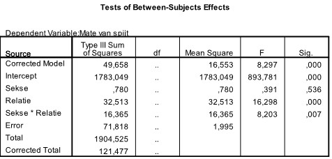
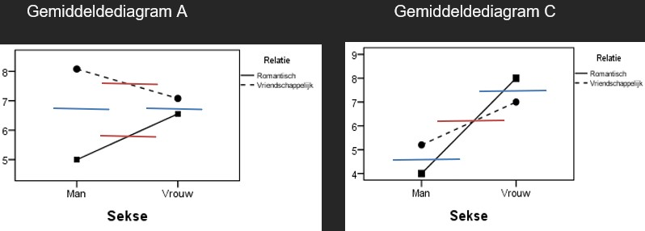

```{r, echo = FALSE, results = "hide"}
include_supplement("uu-Twoway-ANOVA-846-nl-graph01.jpg", recursive = TRUE)
```
```{r, echo = FALSE, results = "hide"}
include_supplement("uu-Twoway-ANOVA-846-nl-graph02.jpg", recursive = TRUE)
```
```{r, echo = FALSE, results = "hide"}
include_supplement("uu-Twoway-ANOVA-846-nl-graph03.jpg", recursive = TRUE)
```
Question
========
Mensen verschillen in de mate waarin ze spijt hebben over wat ze niet gedaan hebben binnen een relatie. In een onderzoek met de factoren SEKSE (man of vrouw) en soort RELATIE (romantisch of vriendschappelijk) is bij de respondenten de 'spijt-van-wat-ik-niet-gedaan-heb-in-mijn-relatie-test' afgenomen. De resultaten van de statistische analyse van de gegevens staan hieronder in de tabel weergegeven. 

Als je afgaat op de resultaten in de onderstaande SPSS uitvoer, welk van de vier gemiddeldendiagrammen past dan het beste bij die resultaten?




Answerlist
----------
* Gemiddeldendiagram  B
* Gemiddeldendiagram  C
* Gemiddeldendiagram  D
* Gemiddeldendiagram  A


Solution
========
In de tabel is te zien dat er geen hoofdeffect is van Sekse (p = .536). Er is wel een hoofdeffect van relatie (p < .001) en ook een interactie-effect (p = .007).
De gemiddeldendiagrammen B en D vallen direct af, hier is geen interactie-effect te zien (de lijnen lopen parallel). In de overige gemiddeldediagrammen moet onderzocht worden welk hoofdeffect aanwezig is. Hieronder is dat voorgedaan, blauw staat voor het hoofdeffect van Sekse. Rood staat voor het hoofdeffect van Relatie. Bedenk dat er wordt gekeken of de strepen op dezelfde hoogte van de y-as staan!



Afgaande op deze lijnen, kan geconcludeerd worden dat er in Gemiddeldediagram A een hoofdeffect van Relatie afgebeeld wordt. En in Gemiddeldediagram C wordt een hoofdeffect van Sekse afgebeeld. Om die reden is Gemiddeldediagram A passend bij de tabel.


Meta-information
================
exname: uu-Twoway-ANOVA-846-nl.Rmd
extype: schoice
exsolution: 0001
exsection: Inferential Statistics/Parametric Techniques/ANOVA/Twoway ANOVA
exextra[ID]: c03b3
exextra[Type]: Interpretating graph, Interpretating output
exextra[Program]: SPSS
exextra[Language]: Dutch
exextra[Level]: Statistical Reasoning