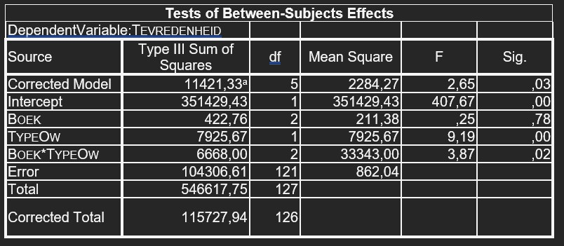

```{r, echo = FALSE, results = "hide"}
include_supplement("uu-Twoway-ANOVA-848-nl-graph01.jpg", recursive = TRUE)
```
Question
========
Below is part of the SPSS output of a statistical analysis on the effect of the book used in a statistics course (BOOK with 1 = Statistics for dummies and 2 = Discovering statistics) and the type of instruction given (TYPEOW with 1 = lecture, 2 = working group, 3 = practicum) on student satisfaction (Satisfaction measured on a scale of 0 to 10).

Based on the results below, which of the statements below is correct when we test for $\alpha$ = 1%?



Answerlist
----------
* There is a significant main effect of book used on satisfaction.
* There is no significant main effect of type of education on satisfaction.
* For the type of education, there is a significant difference in the effect of book on satisfaction.
* For the two books, there is no significant difference in the effect of type of teaching on satisfaction.


Solution
========

Meta-information
================
exname: uu-Twoway-ANOVA-848-en
extype: schoice
exsolution: 0001
exsection: Inferential Statistics/Parametric Techniques/ANOVA/Twoway ANOVA
exextra[Type]: Interpretating output
exextra[Program]: SPSS
exextra[Language]: English
exextra[Level]: Statistical Reasoning