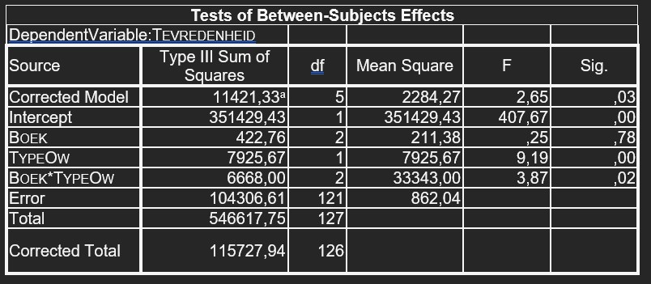

```{r, echo = FALSE, results = "hide"}
include_supplement("uu-Twoway-ANOVA-848-nl-graph01.jpg", recursive = TRUE)
```
Question
========
Hieronder een deel van de SPSS uitvoer van een statistische analyse naar het effect van het boek dat gebruikt wordt bij een statistiekcursus (BOEK met 1 = Statistiek voor dummies en 2 = Discovering statistics) en het type onderwijs dat gegeven wordt (TYPEOW met 1 = hoorcollege, 2 = werkgroep, 3 = practicum) op de tevredenheid van studenten (Tevredenheid gemeten op een schaal van 0 tot 10). 

Uitgaande van de onderstaande resultaten, welke van de onderstaande uitspraken is dan correct als we toetsen bij $\alpha$ = 1%?



Answerlist
----------
* Er is een significant hoofdeffect van het boek dat gebruikt wordt op tevredenheid.
* Er is geen significant hoofdeffect van type onderwijs op de tevredenheid.
* Voor het type onderwijs is er een significant verschil in het effect van het boek op tevredenheid.
* Voor de twee boeken is er geen significant verschil in het effect van type onderwijs op tevredenheid.


Solution
========


Meta-information
================
exname: uu-Twoway-ANOVA-848-nl.Rmd
extype: schoice
exsolution: 0001
exsection: Inferential Statistics/Parametric Techniques/ANOVA/Twoway ANOVA
exextra[Type]: Interpretating output
exextra[Program]: SPSS
exextra[Language]: Dutch
exextra[Level]: Statistical Reasoning