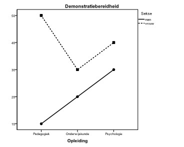

```{r, echo = FALSE, results = "hide"}
include_supplement("uu-Twoway-ANOVA-849-nl-graph01.jpg", recursive = TRUE)
```
Question
========
A survey of a random sample of students on their willingness to demonstrate was conducted prior to recent student demonstrations. A researcher conducts an analysis of variance for DEMONSTRATION READINESS (0 = no readiness through 100 = very high readiness) with the factors Gender and Education. The distinguished groups are all approximately equal in size. 



Using the average chart shown, evaluate the following two statements.  I. There is a main effect of EDUCATION on DEMONSTRATION readiness. II. There is no interaction effect of GENDERxEDUCATION on DEMONSTRATION READINESS.

Answerlist
----------
* I is correct, II is correct.
* I is not correct, II is correct.
* I is not correct, II is not correct.
* I is correct, II is not correct.


Solution
========
Theorem I is not correct We may assume that all groups are about the same size. Then we find mpedagogy = 30, meducation = 25 and mpsychology = 35 (see asterisks in the mean diagram). The average DEMONSTRATION READiness differs between courses. So there is a main effect of EDUCATION on DEMONSTRATION READiness.  Theorem II is not correct In the mean diagram, it can be seen that the lines are not parallel. The effect of EDUCATION on DEMONSTRATION READiness is different for men than for women. Thus, there is an interaction effect of SEKSE×OPLEIDING on DEMONSTRATION READiness.

Meta-information
================
exname: uu-Twoway-ANOVA-849-en
extype: schoice
exsolution: 0001
exsection: Inferential Statistics/Parametric Techniques/ANOVA/Twoway ANOVA
exextra[ID]: 9fecf
exextra[Type]: Interpretating graph
exextra[Program]: SPSS
exextra[Language]: English
exextra[Level]: Statistical Reasoning
