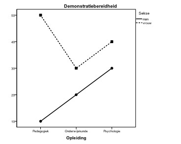

```{r, echo = FALSE, results = "hide"}
include_supplement("uu-Twoway-ANOVA-849-nl-graph01.jpg", recursive = TRUE)
```
Question
========
Voorafgaande aan recente studentendemonstraties is een onderzoek uitgevoerd bij een aselecte steekproef van studenten over hun demonstratiebereidheid. Een onderzoeker voert een variantieanalyse uit voor DEMONSTRATIEBEREIDHEID (0 = geen bereidheid tot en met 100 = zeer grote bereidheid) met de factoren SEKSE en OPLEIDING. De onderscheiden groepen zijn alle ongeveer even groot. 



Beoordeel met het getoonde gemiddeldendiagram de volgende twee uitspraken.
 
I. Er is een hoofdeffect van OPLEIDING op DEMONSTRATIEBEREIDHEID.
II. Er is geen interactie-effect van SEKSExOPLEIDING op DEMONSTRATIEBEREIDHEID.

Answerlist
----------
* I is juist, II is juist.
* I is niet juist, II is juist.
* I is niet juist, II is niet juist.
* I is juist, II is niet juist.


Solution
========
Stelling I is niet juist
We mogen er vanuit gaan dat alle groepen ongeveer even groot zijn. Dan vinden we mpedagogiek = 30, monderwijskunde = 25 en mpsychologie = 35 (zie sterretjes in het gemiddeldendiagram). De gemiddelde DEMONSTRATIEBEREIDHEID verschilt tussen de opleidingen. Er is dus wel een hoofdeffect van OPLEIDING op DEMONSTRATIEBEREIDHEID.
 
Stelling II is niet juist
In het gemiddeldendiagram is te zien dat de lijnen niet parallel lopen. Het effect van OPLEIDING op DEMONSTRATIEBEREIDHEID anders is voor mannen dan voor vrouwen. Er is dus wel sprake van een interactie-effect van SEKSE×OPLEIDING op DEMONSTRATIEBEREIDHEID.


Meta-information
================
exname: uu-Twoway-ANOVA-849-nl.Rmd
extype: schoice
exsolution: 0001
exsection: Inferential Statistics/Parametric Techniques/ANOVA/Twoway ANOVA
exextra[Type]: Interpretating graph
exextra[Program]: SPSS
exextra[Language]: Dutch
exextra[Level]: Statistical Reasoning