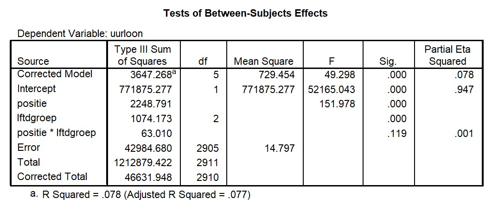

```{r, echo = FALSE, results = "hide"}
include_supplement("uu-Twoway-ANOVA-850-nl-graph01.jpg", recursive = TRUE)
```
Question
========
Er wordt een onderzoek gedaan door een vertegenwoordiger van mensen die in de verpleging werken naar het inkomensniveau van verpleegsters. Er wordt verwacht dat verpleegsters die actief zijn in de verpleging van patiënten in het ziekenhuis meer betaald krijgen dan verpleegsters die vooral kantoorwerk doen in het ziekenhuis (aangegeven door de variabele positie). Bij een “Independent Samples T-Test” blijkt dat dit inderdaad zo is en blijkt dat het verschil in uurloon significant is (p < .001). De vertegenwoordiger wil nu kijken of er ook verschillen zijn tussen drie verschillende leeftijdsgroepen en of de verschillen in uurloon tussen de twee soorten verpleegsters verschillen binnen deze leeftijdsgroepen. 

Een deel van de SPSS output van de analyse van de door de vertegenwoordiger verzamelde data staat hieronder. 



Is de interactie tussen de twee variabelen positie en lftdgroep significant? Wat zijn de toetsingsgrootheid en overschrijdingskans die je gebruikt om deze vraag te beantwoorden?

Answerlist
----------
* Ja, de interactie is significant, F = 2.13, p = .001
* Ja, de interactie is significant, F = 49.298, p < .001
* Nee, de interactie is niet significant, F = 2.13, p = .119
* Nee, de interactie is niet significant, F = 1.42, p = .119


Solution
========


Meta-information
================
exname: uu-Twoway-ANOVA-850-nl.Rmd
extype: schoice
exsolution: 0010
exsection: Inferential Statistics/Parametric Techniques/ANOVA/Twoway ANOVA
exextra[ID]: 1a2dc
exextra[Type]: Interpretating output, Calculation
exextra[Program]: SPSS
exextra[Language]: Dutch
exextra[Level]: Statistical Reasoning