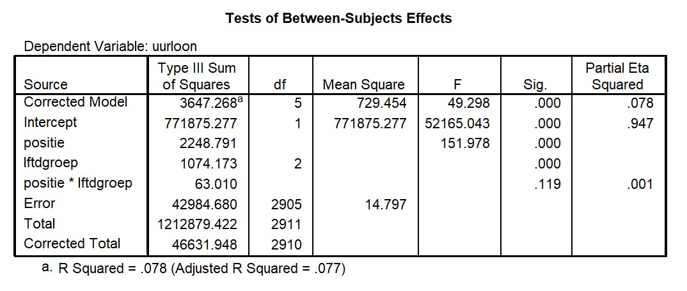
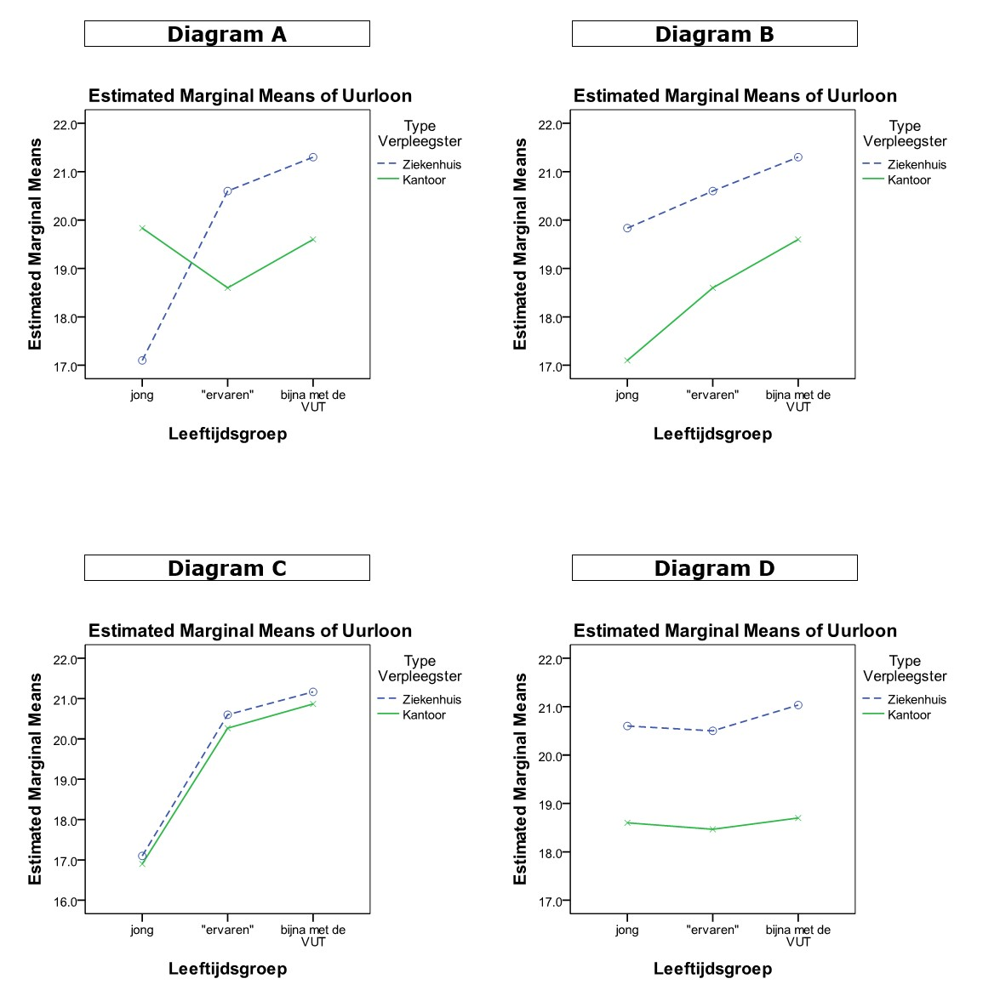

```{r, echo = FALSE, results = "hide"}
include_supplement("uu-Twoway-ANOVA-852-nl-graph01.jpg", recursive = TRUE)
```
```{r, echo = FALSE, results = "hide"}
include_supplement("uu-Twoway-ANOVA-852-nl-graph02.jpg", recursive = TRUE)
```
Question
========
A survey is conducted by a representative of people working in nursing on the income level of nurses. It is expected that nurses who are active in nursing patients in the hospital are paid more than nurses who mainly do office work in the hospital (indicated by the variable position). An "Independent Samples T-Test" shows that this is indeed so and shows that the difference in hourly pay is significant (p < .001). The representative now wants to see if there are also differences between three different age groups and if the differences in hourly wages between the two types of nurses differ within these age groups.

Part of the SPSS output from the analysis of the data collected by the representative is below. 



Below are four interaction diagrams. Which interaction diagram best matches the information given in the text and the SPSS output?



Answerlist
----------
* Diagram A
* Diagram B
* Diagram C
* Diagram D


Solution
========

Meta-information
================
exname: uu-Twoway-ANOVA-852-en
extype: schoice
exsolution: 0100
exsection: Inferential Statistics/Parametric Techniques/ANOVA/Twoway ANOVA
exextra[Type]: Interpretating graph, Calculation
exextra[Program]: SPSS
exextra[Language]: English
exextra[Level]: Statistical Reasoning