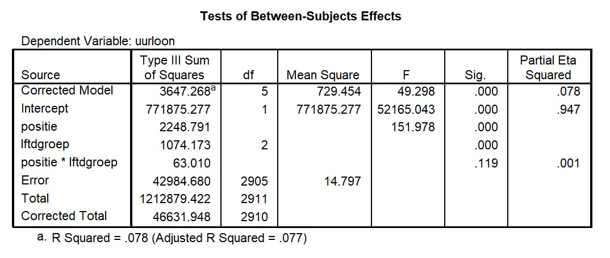
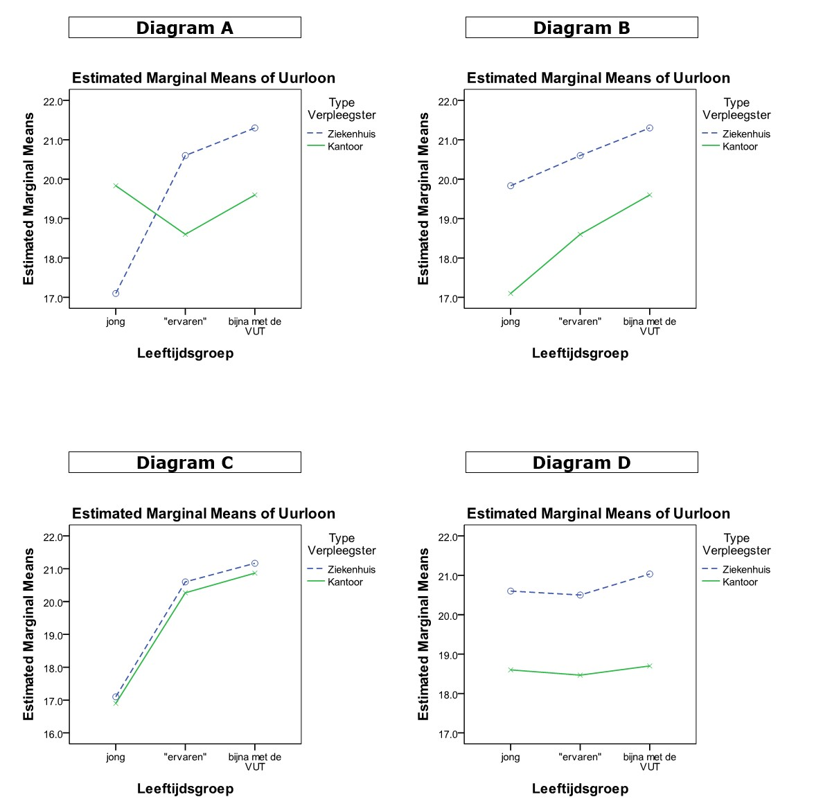

```{r, echo = FALSE, results = "hide"}
include_supplement("uu-Twoway-ANOVA-852-nl-graph01.jpg", recursive = TRUE)
```
```{r, echo = FALSE, results = "hide"}
include_supplement("uu-Twoway-ANOVA-852-nl-graph02.jpg", recursive = TRUE)
```
Question
========
Er wordt een onderzoek gedaan door een vertegenwoordiger van mensen die in de verpleging werken naar het inkomensniveau van verpleegsters. Er wordt verwacht dat verpleegsters die actief zijn in de verpleging van patiënten in het ziekenhuis meer betaald krijgen dan verpleegsters die vooral kantoorwerk doen in het ziekenhuis (aangegeven door de variabele positie). Bij een “Independent Samples T-Test” blijkt dat dit inderdaad zo is en blijkt dat het verschil in uurloon significant is (p < .001). De vertegenwoordiger wil nu kijken of er ook verschillen zijn tussen drie verschillende leeftijdsgroepen en of de verschillen in uurloon tussen de twee soorten verpleegsters verschillen binnen deze leeftijdsgroepen. 

Een deel van de SPSS output van de analyse van de door de vertegenwoordiger verzamelde data staat hieronder. 



Hieronder staan vier interactiediagrammen. Welk interactiediagram komt het best overeen met de gegeven informatie in de tekst en de SPSS output?



Answerlist
----------
* Diagram A
* Diagram B
* Diagram C
* Diagram D


Solution
========


Meta-information
================
exname: uu-Twoway-ANOVA-852-nl.Rmd
extype: schoice
exsolution: 0100
exsection: Inferential Statistics/Parametric Techniques/ANOVA/Twoway ANOVA
exextra[Type]: Interpretating graph, Calculation
exextra[Program]: SPSS
exextra[Language]: Dutch
exextra[Level]: Statistical Reasoning