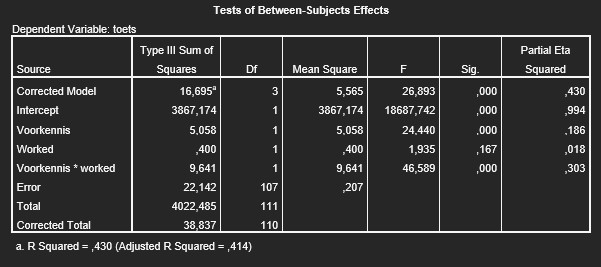

```{r, echo = FALSE, results = "hide"}
include_supplement("uu-Twoway-ANOVA-855-nl-graph01.jpg", recursive = TRUE)
```
Question
========
Below is the SPSS output of a study of the effects of worked examples (WORKED with 0 = no worked examples and 1 = worked examples) on students' performance on a test (TOETS rated with a grade of 1 - 10). This also distinguished the prior knowledge students had about the topic (Voorkennis with 0 = little prior knowledge and 1 = a lot of prior knowledge).



Which statement about impact testing is correct ($\alpha$ = .05)?

Answerlist
----------
* There is no main effect of FORKNIS on TOETS, but there is a main effect of WORKED.
* The effect WORKED is the same for the two categories of FOReknowledge.
* None of the above statements is correct.
* There is a main effect of FORKNESS on TOETS, but no main effect of WORKED.


Solution
========

Meta-information
================
exname: uu-Twoway-ANOVA-855-en
extype: schoice
exsolution: 0001
exsection: Inferential Statistics/Parametric Techniques/ANOVA/Twoway ANOVA
exextra[ID]: 7a45d
exextra[Type]: Interpretating output
exextra[Program]: SPSS
exextra[Language]: English
exextra[Level]: Statistical Reasoning
