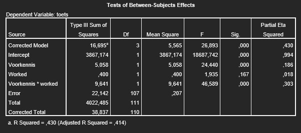

```{r, echo = FALSE, results = "hide"}
include_supplement("uu-Twoway-ANOVA-855-nl-graph01.jpg", recursive = TRUE)
```
Question
========
Hieronder vind je de SPSS-uitvoer van een studie naar de effecten van worked examples (WORKED met 0 = geen worked examples en 1 = wel worked examples) op de prestaties van studenten op een toets  (TOETS beoordeeld met een cijfer van 1 – 10). Hierbij is ook onderscheid gemaakt in de voorkennis die studenten hadden over het onderwerp (VOORKENNIS met 0 = weinig voorkennis en 1 = veel voorkennis).



Welke uitspraak over de toetsing van de effecten is correct ($\alpha$ = .05)?

Answerlist
----------
* Er is geen hoofdeffect van VOORKENNIS op TOETS, maar wél een hoofdeffect van WORKED.
* Het effect WORKED  is voor de twee categorieën van VOORKENNIS gelijk.
* Geen van bovenstaande uitspraken is correct.
* Er is wél een hoofdeffect van VOORKENNIS op TOETS, maar geen hoofdeffect van WORKED.


Solution
========


Meta-information
================
exname: uu-Twoway-ANOVA-855-nl.Rmd
extype: schoice
exsolution: 0001
exsection: Inferential Statistics/Parametric Techniques/ANOVA/Twoway ANOVA
exextra[ID]: 0cf9c
exextra[Type]: Interpretating output
exextra[Program]: SPSS
exextra[Language]: Dutch
exextra[Level]: Statistical Reasoning