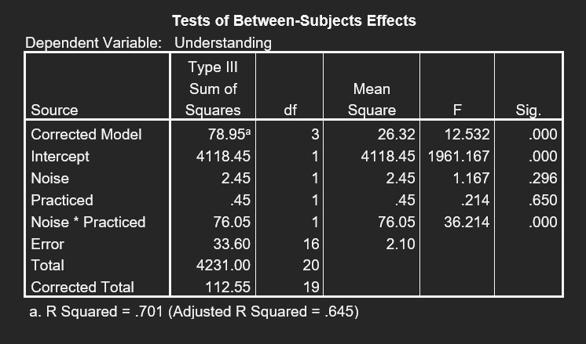
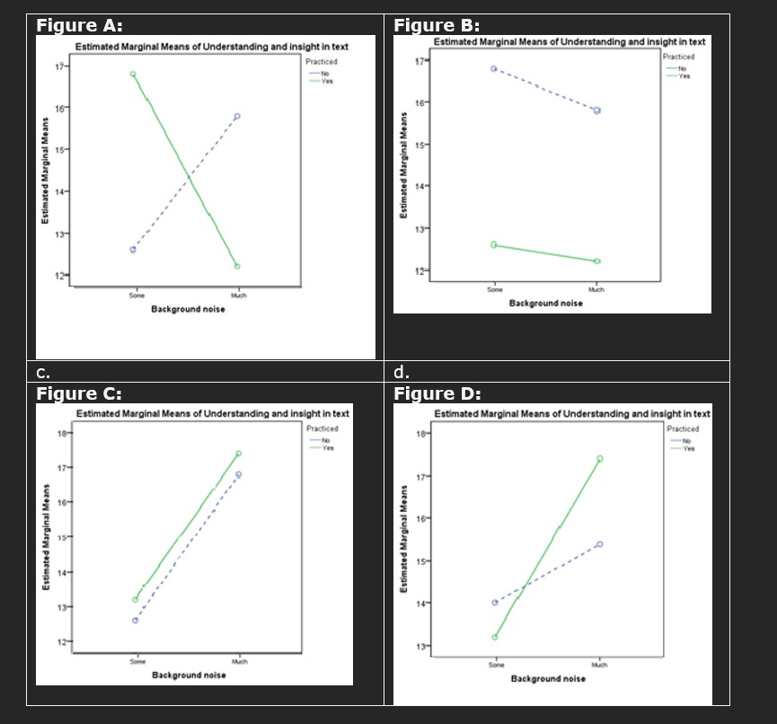

```{r, echo = FALSE, results = "hide"}
include_supplement("uu-Twoway-ANOVA-856-en-graph01.jpg", recursive = TRUE)
```
```{r, echo = FALSE, results = "hide"}
include_supplement("uu-Twoway-ANOVA-856-en-graph02.jpg", recursive = TRUE)
```
Question
========
An experiment focuses on the influence of practicing (Practiced) and background noise (Noise) on the understanding and insight of scholarly texts. Part of the SPSS output is shown below.



Which figure could be a graphic representation of the analysis?



Answerlist
----------
* Figure D
* Figure C
* Figure B
* Figure A


Solution
========
There is a large interaction effect but no large main effects. In figure B there is a strong effect of this because practiced students always score much lower than non-practiced students. In figure c there is no interaction because the lines are parallel. In figure d there is a strong effect of noise because pupils with a little noise always score strongly lower than pupils with a lot of noise. Figure A is therefore the right solution, there is interaction because the lines are not parallel at all, but there are no main effects because experienced and inexperienced students score equally high on average, and students experiencing little and a lot of noise also score approximately the same.


Meta-information
================
exname: uu-Twoway-ANOVA-856-en.Rmd
extype: schoice
exsolution: 0001
exsection: Inferential Statistics/Parametric Techniques/ANOVA/Twoway ANOVA
exextra[ID]: a46a9
exextra[Type]: Interpretating graph, Conceptual
exextra[Program]: SPSS
exextra[Language]: English
exextra[Level]: Statistical Reasoning