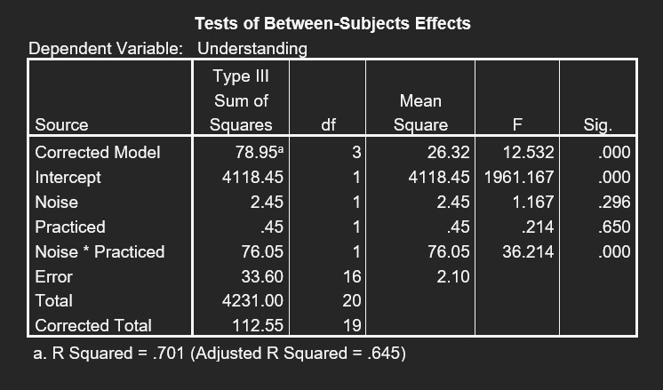
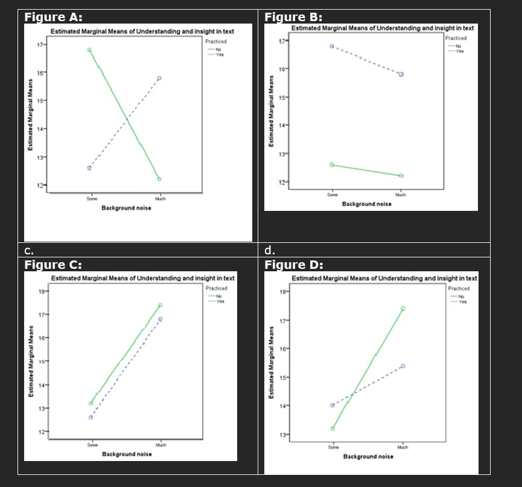

```{r, echo = FALSE, results = "hide"}
include_supplement("uu-Twoway-ANOVA-856-en-graph01.jpg", recursive = TRUE)
```
```{r, echo = FALSE, results = "hide"}
include_supplement("uu-Twoway-ANOVA-856-en-graph02.jpg", recursive = TRUE)
```
Question
========
Een experiment richt zich op de invloed van oefenen (Practiced) en achtergrondruis (Noise) op het begrip en inzicht van wetenschappelijke teksten. Een deel van de SPSS-uitvoer wordt hieronder getoond.



Welke figuur zou een grafische weergave van de analyse kunnen zijn?



Antwoordlijst
----------
* Figuur D
* Figuur C
* Figuur B
* Figuur A


Solution
========
Er is een groot interactie-effect maar geen grote hoofdeffecten. In figuur B is er een sterk effect omdat geoefende leerlingen altijd veel lager scoren dan niet-geoefende leerlingen. In figuur c is er geen interactie omdat de lijnen parallel lopen. In figuur d is er een sterk effect van ruis omdat leerlingen met een beetje ruis altijd sterk lager scoren dan leerlingen met veel ruis. Figuur A is dus de juiste oplossing, er is wel interactie omdat de lijnen helemaal niet parallel lopen, maar er zijn geen hoofdeffecten omdat ervaren en onervaren leerlingen gemiddeld even hoog scoren en leerlingen die weinig en veel lawaai ervaren ook ongeveer even hoog scoren.

Meta-information
================
exname: uu-Twoway-ANOVA-856-nl
extype: schoice
exsolution: 0001
exsection: Inferential Statistics/Parametric Techniques/ANOVA/Twoway ANOVA
exextra[Type]: Interpretating graph, Conceptual
exextra[Program]: SPSS
exextra[Language]: Dutch
exextra[Level]: Statistical Reasoning