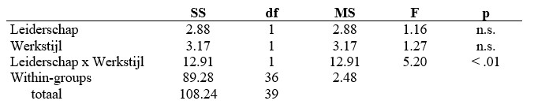

```{r, echo = FALSE, results = "hide"}
include_supplement("uu-Twoway-ANOVA-864-nl-tabel.jpg", recursive = TRUE)
```


Question
========
  
De resultaten van een experiment waarin twee soorten leiderschap (variabele ‘leiderschap’) en twee typen werkstijlen (variabele ‘werkstijl’) zijn vergeleken, zijn hieronder gepresenteerd in een tabel. De afhankelijke variabele is ‘tevredenheid met het werk’. Getoetst wordt op 5%.



Hoeveel procent van de variantie in Arbeidstevredenheid wordt verklaard door het interactie-effect?
  
Answerlist
----------
* 9.4%
* 11.4%
* 32.2%
* 33.8%


Solution
=========

  
Meta-information
================
exname: uu-Twoway-ANOVA-864-nl.Rmd
extype: schoice
exsolution: 1000
exsection: Inferential Statistics/Parametric Techniques/ANOVA/Twoway ANOVA
exextra[ID]: 303cc
exextra[Type]: Calculation
exextra[Language]: Dutch
exextra[Level]: Statistical Literacy
