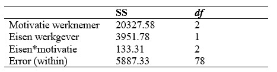

```{r, echo = FALSE, results = "hide"}
include_supplement("uu-Twoway-ANOVA-865-nl-tabel.jpg", recursive = TRUE)
```


Question
========
  
Bereken de proportie verklaarde variantie van werknemersmotivatie aan de hand van de volgende gegevens. Wat is het juiste antwoord?


  
Answerlist
----------
* .23
* .51
* .66
* .93

Solution
========
  


Meta-information
================
exname: uu-Twoway-ANOVA-865-nl.Rmd
extype: schoice
exsolution: 0010
exsection: Inferential Statistics/Parametric Techniques/ANOVA/Twoway ANOVA
exextra[Type]: Interpretating output, Calculation
exextra[Language]: Dutch
exextra[Level]: Statistical Literacy
