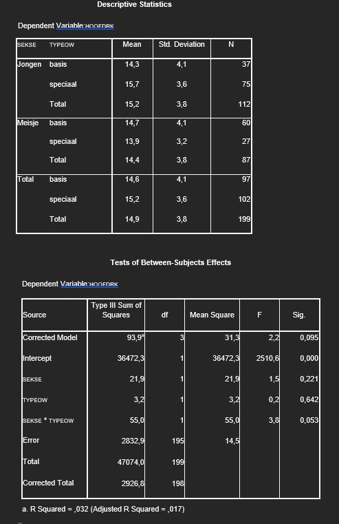

```{r, echo = FALSE, results = "hide"}
include_supplement("uu-Twoway-ANOVA-870-nl-graph01.jpg", recursive = TRUE)
```
Question
========
A researcher conducts a statistical analysis for main arithmetic (HOOFDRK; 1 = not proficient to 20 = very proficient) with the factors SEKSE (1 = boy, 2 = girl) and type of education (TYPEOW; 0 = basic, 1 = special).

Using the SPSS output for the effects of SEKSE and TYPEOW, evaluate the following two statements.

I. There is no significant ($\alpha$ = 10%) interaction effect of SEKSE and TYPEOW on HOOFDRK. II. The percentage explained variance in head math by the model is less than 10%.



Answerlist
----------
* I is correct, II is correct
* I is true, II is false
* I is not right, II is not right
* I is not right, II is right


Solution
========
Theorem I is incorrect There is a significant $\alpha$ = 10%) interaction effect of SEKSE×TYPEOW on HOOFDRK, because p = .053 < $\alpha$ = .10

Theorem II is correct The percentage of explained variance in head counts by the model is less than 10% because $R^2$ =.032 < 10%

Meta-information
================
exname: uu-Twoway-ANOVA-870-en
extype: schoice
exsolution: 0001
exsection: Inferential Statistics/Parametric Techniques/ANOVA/Twoway ANOVA
exextra[Type]: Interpretating output
exextra[Program]: SPSS
exextra[Language]: English
exextra[Level]: Statistical Reasoning