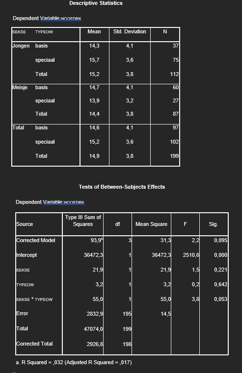

```{r, echo = FALSE, results = "hide"}
include_supplement("uu-Twoway-ANOVA-870-nl-graph01.jpg", recursive = TRUE)
```
Question
========
Een onderzoeker voert een statistische analyse uit voor hoofdrekenen (HOOFDRK; 1 = niet vaardig tot en met 20 = zeer vaardig) met de factoren SEKSE (1 = jongen, 2 = meisje) en type onderwijs (TYPEOW; 0 = basis, 1 = speciaal). 

Beoordeel met de SPSS-uitvoer voor de effecten van SEKSE en TYPEOW de volgende twee uitspraken.

I. Er is geen significant ($\alpha$ = 10%) interactie-effect van SEKSE en TYPEOW op HOOFDRK.
II. Het percentage verklaarde variantie in hoofdrekenen door het model is minder dan 10%.



Answerlist
----------
* I is juist, II is juist
* I is juist, II is niet juist
* I is niet juist, II is niet juist
* I is niet juist, II is juist


Solution
========
Stelling I is niet juist
Er is een significant $\alpha$ = 10%) interactie-effect van SEKSE×TYPEOW op
HOOFDRK, want p = .053 < $\alpha$ = .10

Stelling II is juist
Het percentage verklaarde variantie in hoofdrekenen door het model is minder dan 10%, want $R^2$ =.032 < 10%


Meta-information
================
exname: uu-Twoway-ANOVA-870-nl.Rmd
extype: schoice
exsolution: 0001
exsection: Inferential Statistics/Parametric Techniques/ANOVA/Twoway ANOVA
exextra[ID]: a5c74
exextra[Type]: Interpretating output
exextra[Program]: SPSS
exextra[Language]: Dutch
exextra[Level]: Statistical Reasoning