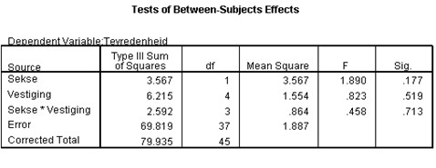

```{r, echo = FALSE, results = "hide"}
include_supplement("uu-Twoway-ANOVA-871-nl-graph01.jpg", recursive = TRUE)
```
Question
========
The manager of a large company with 5 different branches has asked his employees to complete a questionnaire on job satisfaction and working conditions (5 point Likert scale). The manager would like to know if there are differences between male and female employees within the five branches.



Which null hypothesis tests the test size F = 0.458?

Answerlist
----------
* $H_{0}$: the average satisfaction scores of men and women are equal
* $H_{0}$: the average satisfaction scores within the five branches are the same
* $H_{0}$: the differences (if any) in average satisfaction scores between the five sites are different for men and women.
* $H_{0}$: the differences (if any) in average satisfaction scores between men and women are the same for all five sites.


Solution
========

Meta-information
================
exname: uu-Twoway-ANOVA-871-en
extype: schoice
exsolution: 0001
exsection: Inferential Statistics/Parametric Techniques/ANOVA/Twoway ANOVA
exextra[Type]: Case
exextra[Program]: SPSS
exextra[Language]: English
exextra[Level]: Statistical Reasoning