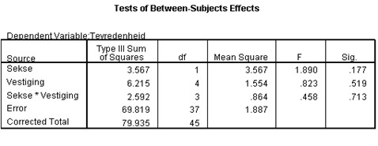

```{r, echo = FALSE, results = "hide"}
include_supplement("uu-Twoway-ANOVA-871-nl-graph01.jpg", recursive = TRUE)
```
Question
========
De manager van een groot bedrijf met 5 verschillende vestigingen heeft aan zijn medewerkers gevraagd om een vragenlijst in te vullen over de tevredenheid op het werk en de werkomstandigheden (5 punt Likert-schaal). De manager wil graag weten of er verschillen zijn tussen de mannelijke en vrouwelijke werknemers binnen de vijf vestigingen.



Welke nulhypothese toetst de toetsingsgrootheid F = 0.458?

Answerlist
----------
* $H_{0}$: de gemiddelde tevredenheidscores van mannen en vrouwen zijn gelijk
* $H_{0}$: de gemiddelde tevredenheidscores binnen de vijf vestigingen zijn gelijk
* $H_{0}$: de (eventuele) verschillen in gemiddelde tevredenheidscores tussen de vijf vestigingen zijn anders voor mannen en vrouwen.
* $H_{0}$: de (eventuele) verschillen in gemiddelde tevredenheidscores tussen mannen en vrouwen zijn gelijk voor alle vijf vestigingen.


Solution
========


Meta-information
================
exname: uu-Twoway-ANOVA-871-nl.Rmd
extype: schoice
exsolution: 0001
exsection: Inferential Statistics/Parametric Techniques/ANOVA/Twoway ANOVA
exextra[Type]: Case
exextra[Program]: SPSS
exextra[Language]: Dutch
exextra[Level]: Statistical Reasoning