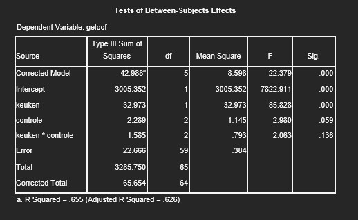

```{r, echo = FALSE, results = "hide"}
include_supplement("uu-Twoway-ANOVA-872-nl-graph01.jpg", recursive = TRUE)
```
Question
========
"No matter how serious the problems of the present are, in the future they will be solved." is one of the items used in a survey on belief in progress. In the study, people were distinguished by the degree to which they perceived control over their own lives (CONTROL with the categories 1. Low control, 2. Moderate control and 3. Strong control). In addition, people were also asked whether they valued Dutch cuisine more than Italian cuisine (KITCHEN with the categories 1. Dutch and 2. Italian). The researcher conducted an analysis of variance on the effects of CONTROL and CHEESE on BELIEF. The SPSS output is given below.



Which null hypotheses are rejected ($\alpha$= 10%)?

Answerlist
----------
* $H_{0}$: $$mu_{CONTROLE1}$ = $$mu_{CONTROLE2}$ = $$mu_{CONTROLE3}$ èn	$H_{0}$: ${mu_{KEKEN1}$ = ${mu_{KEKEN2}$ èn $H_{0}$ No interaction effect
* $H_{0}$: $$mu_{CONTROLE2}$ = $$mu_{CONTROLE3}$.
* $H_{0}$: $$mu_{KEKEKEN1}$ = $$mu_{KEKEN2}$.
* $H_{0}$: $$mu_{CONTROLE1}$ = $$mu_{CONTROLE2}$ = $$mu_{CONTROLE3}$ èn 	$H_{0}$: $\mu_{KEUKEN1}$ = $\mu_{KEUKEN2}$


Solution
========
To answer this question, look in the Sig. column, in the rows of the main effects (kitchen & control) and in the row of the interaction effect (kitchen * control). Since the $\alpha$ is determined to be .10, any p-value below .10 is significant. Thus, both main effects are significant (p = .000 and .059, respectively), but the interaction effect is not (p = .136). This means that the null hypotheses of the main effects can be rejected. The null hypothesis of the interaction effect cannot be rejected.

The SPSS output shows that only both main effects are significant, and the interaction effect is not significant.

Main effect CHOICE: p < .001 < $\alpha$ = .10 Main effect CONTROL: p = .059 < $\alpha$ = .10 Interaction effect KITCHEN×CONTROLE: p = .136 >. $\alpha$ = .10

The null hypotheses 'There is no main effect of CHOICE $\mu_{KEUKEN1}$ = $\mu_{KEUKEN2}$' and 'There is no main effect of CONTROL ($\mu_{CONTROLE1}$ = $\mu_{CONTROLE2}$ = $\mu_{CONTROLE3})$' are rejected.

Meta-information
================
exname: uu-Twoway-ANOVA-872-en
extype: schoice
exsolution: 0001
exsection: Inferential Statistics/Parametric Techniques/ANOVA/Twoway ANOVA
exextra[Type]: Conceptual, Interpretating output
exextra[Program]: SPSS
exextra[Language]: English
exextra[Level]: Statistical Reasoning