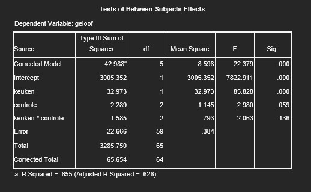

```{r, echo = FALSE, results = "hide"}
include_supplement("uu-Twoway-ANOVA-872-nl-graph01.jpg", recursive = TRUE)
```
Question
========
‘Hoe ernstig de problemen van het heden ook zijn, in de toekomst zullen ze worden opgelost.’ is een van de items die is gebruikt in een onderzoek naar het geloof in vooruitgang. In het onderzoek werden mensen onderscheiden in de mate waarin ze controle over hun eigen leven ervaren (CONTROLE met de categorieën 1. Geringe controle, 2. Matige controle en 3. Sterke controle). Daarnaast is ook gevraagd of ze de Hollandse keuken meer waarderen dan de Italiaanse keuken (KEUKEN met de categorieën 1. Hollands en 2. Italiaans). De onderzoeker heeft een variantieanalyse uitgevoerd naar de effecten van CONTROLE en KEUKEN op GELOOF. De SPSS uitvoer staat hieronder gegeven.



Welke nulhypotheses worden verworpen ($\alpha$= 10%)?

Answerlist
----------
* $H_{0}$: $\mu_{CONTROLE1}$ = $\mu_{CONTROLE2}$ = $\mu_{CONTROLE3}$	èn	$H_{0}$: $\mu_{KEUKEN1}$ = $\mu_{KEUKEN2}$	èn $H_{0}$ Geen interactie-effect
* $H_{0}$: $\mu_{CONTROLE2}$ = $\mu_{CONTROLE3}$
* $H_{0}$: $\mu_{KEUKEN1}$ = $\mu_{KEUKEN2}$
* $H_{0}$: $\mu_{CONTROLE1}$  = $\mu_{CONTROLE2}$ = $\mu_{CONTROLE3}$	èn 	$H_{0}$: $\mu_{KEUKEN1}$ = $\mu_{KEUKEN2}$


Solution
========
Om deze vraag te beantwoorden dient gekeken te worden in de kolom Sig., in de rijen van de hoofdeffecten (keuken & controle) en in de rij van het interactie-effect (keuken * controle). Aangezien de $\alpha$ bepaald is op .10, is elke p-waarde onder de .10 significant. Zodoende zijn de beide hoofdeffecten significant (p = resp. .000 en .059), maar het interactie-effect niet (p = .136). Dat betekent dat de nulhypotheses van de hoofdeffecten verworpen kunnen worden. De nulhypothese van het interactie-effect kan niet verworpen worden. 

In de SPSS output is te zien dat alleen beide hoofdeffecten significant zijn, en het interactie effect is niet significant. 

Hoofdeffect KEUKEN: p < .001 < $\alpha$ = .10
Hoofdeffect CONTROLE: p = .059 < $\alpha$ = .10
Interactie-effect KEUKEN×CONTROLE: p = .136 > $\alpha$ = .10

De nulhypotheses ‘Er is geen hoofdeffect van KEUKEN $\mu_{KEUKEN1}$ = $\mu_{KEUKEN2}$’ en ‘Er is geen hoofdeffect van CONTROLE ($\mu_{CONTROLE1}$ = $\mu_{CONTROLE2}$ = $\mu_{CONTROLE3})$’ worden verworpen.


Meta-information
================
exname: uu-Twoway-ANOVA-872-nl.Rmd
extype: schoice
exsolution: 0001
exsection: Inferential Statistics/Parametric Techniques/ANOVA/Twoway ANOVA
exextra[Type]: Conceptual, Interpretating output
exextra[Program]: SPSS
exextra[Language]: Dutch
exextra[Level]: Statistical Reasoning