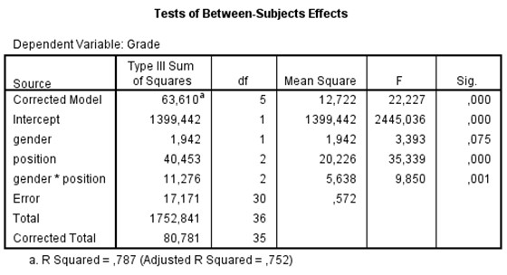

```{r, echo = FALSE, results = "hide"}
include_supplement("uu-Twoway-ANOVA-874-nl-graph01.jpg", recursive = TRUE)
```
Question
========
A number of students are participating in a study of the academic performance (grades) of students related to seating (position). Are there differences between the grades of students who always sit in the front of the lecture hall compared to students who sit in the middle and to students who sit in the back? Part of the SPSS output is below. 



How many students in total participated in this study?

Answerlist
----------
* 31
* 32
* 37
* 36


Solution
========

Meta-information
================
exname: uu-Twoway-ANOVA-874-en
extype: schoice
exsolution: 0001
exsection: Inferential Statistics/Parametric Techniques/ANOVA/Twoway ANOVA
exextra[ID]: bb238
exextra[Type]: Interpretating output
exextra[Program]: SPSS
exextra[Language]: English
exextra[Level]: Statistical Reasoning