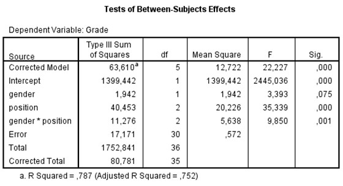

```{r, echo = FALSE, results = "hide"}
include_supplement("uu-Twoway-ANOVA-877-nl-graph01.jpg", recursive = TRUE)
```

Question
========
A number of students are participating in a study of the academic performance (grades) of students related to seating (position). Are there differences between the grades of students who always sit in the front of the lecture hall compared to students who sit in the middle and to students who sit in the back? Part of the SPSS output is below. 



Which conclusion about students' grades is correct?

Answerlist
----------
* Students in the front of the room score significantly higher than students in the middle or back of the room. Boys' average grades are not significantly different from girls'. Because the interaction is significant, it could be that at the front of the room, boys score higher than girls, but at the back of the room, girls score higher.
* The main effect of gender is not significant. Thus, there are no differences between the mean grades of boys and girls. However, there are significant differences in mean grades between students sitting in the front, middle or back of the room. The interaction effect is significant; this means that the differences between front, middle and back for boys do not differ from girls.
* The effect of seating position on grade is not different for the boys than for girls. Overall, there are differences in average grades of students in the three different seats. Overall, there are no differences in average grades of boys and girls.
* The effect of seat location on grade is different for boys than for girls. Overall, there are differences in average grades of students in the three different seats. Overall, boys and girls do not score differently on average, but the differences between boys and girls are reflected when we look at them by seat.


Solution
========

Meta-information
================
exname: uu-Twoway-ANOVA-877-en
extype: schoice
exsolution: 0001
exsection: Inferential Statistics/Parametric Techniques/ANOVA/Twoway ANOVA
exextra[Type]: Interpretating output
exextra[Program]: SPSS
exextra[Language]: English
exextra[Level]: Statistical Reasoning