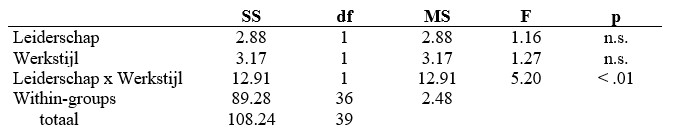

```{r, echo = FALSE, results = "hide"}
include_supplement("uu-Twoway-ANOVA-878-nl-tabel.jpg", recursive = TRUE)
```

Question
========
The results of an experiment comparing two types of leadership (variable 'leadership') and two types of work styles (variable 'work style') are presented in a table below. The dependent variable is "satisfaction with work. Tested at 5%.



What percentage of the variance in Job Satisfaction is explained by the interaction effect?

Answerlist
----------
* 9.4%
* 11.4%
* 32.2%
* 33.8%


Solution
========

Meta-information
================
exname: uu-Twoway-ANOVA-878-en
extype: schoice
exsolution: 1000
exsection: Inferential Statistics/Parametric Techniques/ANOVA/Twoway ANOVA
exextra[ID]: 6b077
exextra[Type]: Interpretating output
exextra[Program]: SPSS
exextra[Language]: English
exextra[Level]: Statistical Literacy