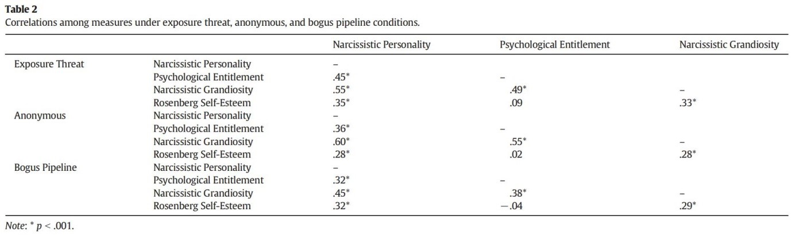
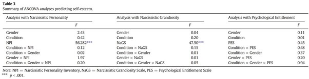

```{r, echo = FALSE, results = "hide"}
include_supplement("uu-Type-I-error-801-nl-tabel.jpg", recursive = TRUE)
```

```{r, echo = FALSE, results = "hide"}
include_supplement("uu-Type-I-error-801-nl-tabel2.jpg", recursive = TRUE)
```

Question
========
  
Table 2 from Brunell and Fisher's (2014) article, "Using the Bogus Pipeline to Investigate Grandiose Narcissism," shows the correlations between the study variables in the different conditions.





Using the formula below, determine how likely it is that the researchers made at least one Type I error in the analyses when they made each correlation in the table $\alpha= .05$ have used?

Chance $=$ $1 - (1-\alpha^c)$
  
Answerlist
----------
* 5.00%
* 39.72%
* 60.28%
* 90.00%

Solution
========

Meta-information
================
exname: uu-Type-I-error-801-en
extype: schoice
exsolution: 0010
exsection: Inferential Statistics/NHST/Statistical errors/Type I error
exextra[ID]: 34a61
exextra[Type]: Calculation
exextra[Program]: SPSS
exextra[Language]: English
exextra[Level]: Statistical Literacy
