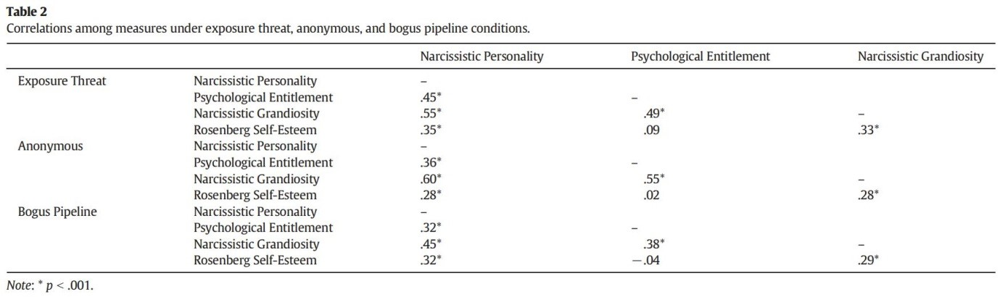
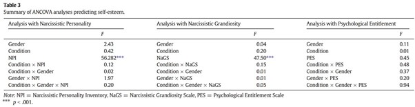

```{r, echo = FALSE, results = "hide"}
include_supplement("uu-Type-I-error-801-nl-tabel.jpg", recursive = TRUE)
```

```{r, echo = FALSE, results = "hide"}
include_supplement("uu-Type-I-error-801-nl-tabel2.jpg", recursive = TRUE)
```

Question
========
  
Tabel 2 uit het artikel van Brunell en Fisher (2014), "Using the Bogus Pipeline to Investigate Grandiose Narcissism", laat de correlaties zien tussen de studievariabelen in de verschillende condities.





Bepaal op basis van onderstaande formule hoe groot de kans is dat de onderzoekers bij de analyses ten minste een type I fout hebben gemaakt wanneer ze bij elke correlatie in de tabel $\alpha= .05$ hebben gebruikt?

Kans $=$ $1 - (1-\alpha^c)$
  
Answerlist
----------
* 5.00%
* 39.72%
* 60.28%
* 90.00%

Solution
========
  


Meta-information
================
exname: uu-Type-I-error-801-nl.Rmd
extype: schoice
exsolution: 0010
exsection: Inferential Statistics/NHST/Statistical errors/Type I error
exextra[Type]: Calculation
exextra[Program]: SPSS
exextra[Language]: Dutch
exextra[Level]: Statistical Literacy
