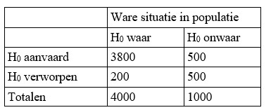

```{r, echo = FALSE, results = "hide"}
include_supplement("uu-Type-II-error-801-nl-tabel.jpg", recursive = TRUE)
```

Question
========
The table below comes from a study on jurisprudence in the Netherlands. We find information about 5000 court cases (4000 + 1000). The court cases test the following hypotheses:

$H_0$: person is innocent

$H_1$ : person is guilty

From the table you can see what the chosen alpha and beta were in this study.



What (inexcusable) error did the researcher make?


  
Answerlist
----------
* The researcher chose alpha far too large, causing $H_0$ should be rejected far too quickly.
* The investigator gets a large Type I error.
* The probability of a Type II error is far too high.
* The investigator has made no errors of principle.

Solution
========

Meta-information
================
exname: uu-Type-II-error-801-en
extype: schoice
exsolution: 0010
exsection: Inferential Statistics/NHST/Statistical errors/Type II error
exextra[ID]: 911b3
exextra[Type]: Case
exextra[Language]: English
exextra[Level]: Statistical Literacy
