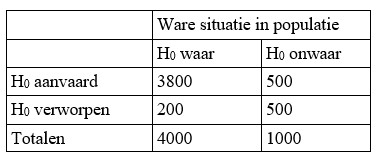

```{r, echo = FALSE, results = "hide"}
include_supplement("uu-Type-II-error-801-nl-tabel.jpg", recursive = TRUE)
```


Question
========
Onderstaande tabel komt uit een onderzoek naar rechtspraak in Nederland. We vinden informatie over 5000 rechtzaken (4000 + 1000). 
In de rechtzaken worden de volgende hypotheses getoetst:

$H_0$: persoon is onschuldig

$H_1$: persoon is schuldig

Uit de tabel kun je opmaken wat de gekozen alpha en beta zijn geweest in dit onderzoek.



Welke (onvergeeflijke) fout heeft de onderzoeker gemaakt?


  
Answerlist
----------
* De onderzoeker heeft alpha veel te groot gekozen, waardoor $H_0$ veel te snel moet worden verworpen.
* De onderzoeker krijgt een grote fout van het type I.
* De kans op een type II fout is veel te groot
* De onderzoeker heeft geen principiële fouten gemaakt.


Solution
========
  


Meta-information
================
exname: uu-Type-II-error-801-nl.Rmd
extype: schoice
exsolution: 0010
exsection: Inferential Statistics/NHST/Statistical errors/Type II error
exextra[ID]: 80137
exextra[Type]: Case
exextra[Language]: Dutch
exextra[Level]: Statistical Literacy
