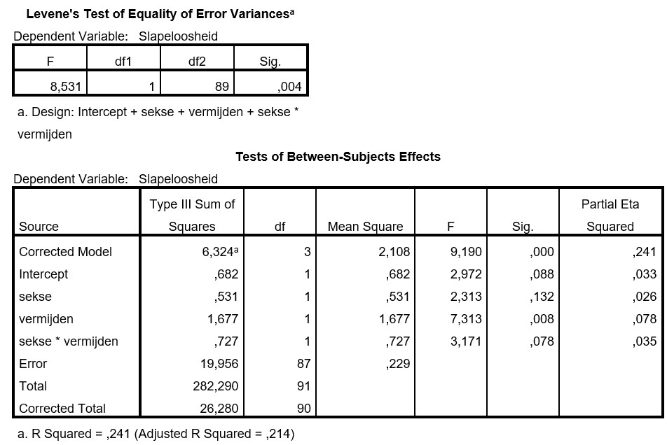

```{r, echo = FALSE, results = "hide"}
include_supplement("uu-ancova-855-nl-graph01.jpg", recursive = TRUE)
```
Question
========
A researcher is interested in differences in insomnia between men and women. The researcher believes that some of the differences in insomnia can be explained by the extent to which people avoid problems. The researcher therefore conducts a covariance analysis controlling for problem avoidance. The researcher obtains the following outputs, among others:



Is the condition of homogeneity of regression coefficients met?

Answerlist
----------
* No, because p = .004
* No, because p = .078
* Yes, because p = .004
* Yes, because p = .078

Solution
========
The condition of homogeneity of regression coefficients is met when the interaction effect between your factor (independent variable) and your covariate is not significant. The table shows that the p-value of the interaction effect is not significant (p = .078). Thus, the condition homogeneity of regression coefficients is met.

Meta-information
================
exname: uu-ancova-855-en
extype: schoice
exsolution: 0001
exsection: Inferential Statistics/Parametric Techniques/ANOVA/ANCOVA
exextra[ID]: 80ab5
exextra[Type]: Interpretating output
exextra[Program]: SPSS
exextra[Language]: English
exextra[Level]: Statistical Reasoning