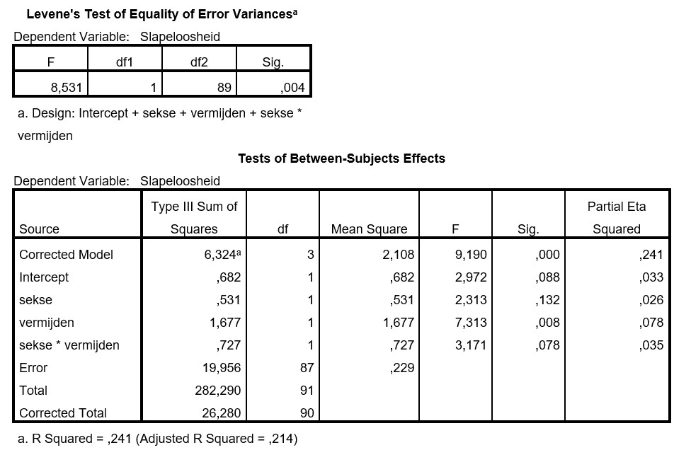

```{r, echo = FALSE, results = "hide"}
include_supplement("uu-ancova-855-nl-graph01.jpg", recursive = TRUE)
```
Question
========
Een onderzoeker is geïnteresseerd in verschillen in slapeloosheid tussen mannen en vrouwen. De onderzoeker denkt dat een deel van de verschillen in slapeloosheid verklaard kunnen worden door de mate waarin mensen problemen vermijden. De onderzoeker voert daarom een covariantieanalyse uit waarbij gecontroleerd wordt voor problemen vermijden. De onderzoeker krijgt onder andere de volgende output:



Is voldaan aan de voorwaarde van homogeniteit van regressiecoëfficiënten?

Answerlist
----------
* Nee, want p = .004
* Nee, want p = .078
* Ja, want p = .004
* Ja, want p = .078

Solution
========
Er is voldaan aan de voorwaarde van homogeniteit van regressiecoëfficiënten wanneer het interactie effect tussen je factor (onafhankelijke variabele) en je covariaat niet significant is. In de tabel is te zien dat de p-waarde van het interactie effect niet significant is (p = .078). Er is dus voldaan aan de voorwaarde homogeniteit van regressiecoëfficiënten.  

Meta-information
================
exname: uu-ancova-855-nl
extype: schoice
exsolution: 0001
exsection: Inferential Statistics/Parametric Techniques/ANOVA/ANCOVA
exextra[ID]: 3ab4c
exextra[Type]: Interpretating output 
exextra[Program]:SPSS 
exextra[Language]: Dutch
exextra[Level]: Statistical Reasoning