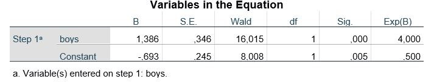

```{r, echo = FALSE, results = "hide"}
include_supplement("uu-logistic-regression-801-en-tabel.JPG", recursive = TRUE)
```


Question
========
  
A teacher wonders whether boys performed differently on the MET22 exam than girls, and conducts a logistic regression with the dependent variable passing the exam (1 = yes, 0 = no) and a dummy variable boys (1 = boy, 0 = girl). Part of the SPSS Output is shown below: 



Which statement is correct about the comparison between boys and girl w.r.t. passing the exam? 
  
Answerlist
----------
* The probability that boys pass the exam is 4 times the probability that girls pass. 
* The probability that girls pass the exam is 0.5 times the probability that boys pass.
* The odds that boys pass the exam are 4 times the odds that girls pass.
* The odds that girls pass the exam are 0.5 times the odds that boys pass.

Solution
========


Answerlist
----------
* This answer is incorrect.
* This answer is incorrect.
* This answer is correct.
* This answer is incorrect.

Meta-information
================
exname: uu-logistic-regression-801-en.Rmd
extype: schoice
exsolution: 0010
exsection: Inferential Statistics/Regression/Logistic regression
exextra[ID]: 31959
exextra[Type]: Interpretating output, Case
exextra[Program]: SPSS
exextra[Language]: English
exextra[Level]: Statistical Literacy