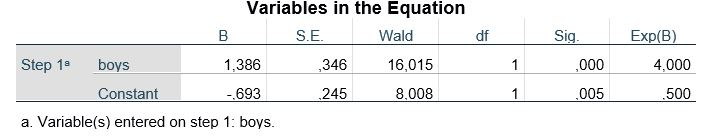

```{r, echo = FALSE, results = "hide"}
include_supplement("uu-logistic-regression-801-en-tabel.JPG", recursive = TRUE)
```


Question
========
  
Een docent vraagt zich af of jongens anders presteren op het MET22-examen dan meisjes en voert een logistische regressie uit met de afhankelijke variabele slagen voor het examen (1 = ja, 0 = nee) en een dummyvariabele jongens (1 = jongen, 0 = meisje). Hieronder staat een deel van de SPSS-uitvoer: 



Welke uitspraak is juist over de vergelijking tussen jongens en meisjes met betrekking tot het slagen voor het examen? 
Antwoordlijst
----------
* De kans dat jongens slagen voor het examen is 4 keer zo groot als de kans dat meisjes slagen.
* De kans dat meisjes slagen voor het examen is 0,5 keer de kans dat jongens slagen.
* De kans dat jongens slagen voor het examen is 4 keer de kans dat meisjes slagen.
* De kans dat meisjes slagen voor het examen is 0,5 keer de kans dat jongens slagen.

Solution
========

Antwoordlijst
----------
* Dit antwoord is onjuist.
* Dit antwoord is onjuist.
* Dit antwoord is juist.
* Dit antwoord is onjuist.

Meta-information
================
exname: uu-logistic-regression-801-nl
extype: schoice
exsolution: 0010
exsection: Inferential Statistics/Regression/Logistic regression
exextra[Type]: Interpretating output, Case
exextra[Program]: SPSS
exextra[Language]: Dutch
exextra[Level]: Statistical Literacy