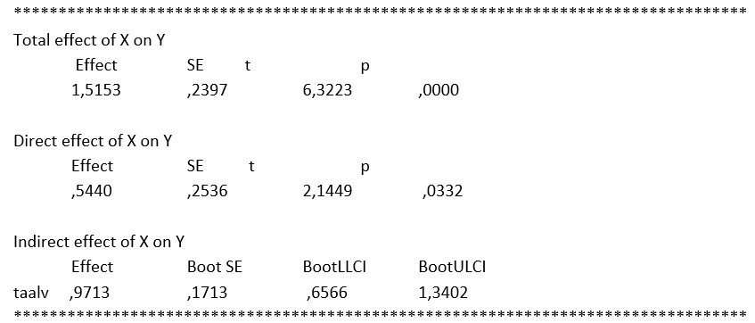

```{r, echo = FALSE, results = "hide"}
include_supplement("uu-mediation-801-nl-tabel.jpg", recursive = TRUE)
```

Question
========
  
A psychologist is investigating whether the effect of age on creativity in children is through language ability. She gets the following output from her SPSS analysis. 



The psychologist concludes from the above output that the effect of age is indeed through language ability.  Is this correct? 
Answerlist
----------
* Yes, because b = 0.9713 and BCa CI [0.6566, 1.3402]
* Yes, because b = 1.5153 and t=6.3223, p=.0000
* No, because b = 0.9713 and BCa CI [0.6566, 1.3402]
* No, because b = 1.5153 and t=6.3223, p=.0000

Solution
========
To determine if there is mediation, or in other words, to see if the effect of age on creativity is through language ability, we look at the indirect effect in the output. In this output, we cannot read a p-value, but we can read a bootstrapped confidence interval. The zero is not in this confidence interval; thus, the indirect effect is significant. In other words, the effect of age on creativity in children is through language ability.

Meta-information
================
exname: uu-mediation-801-en
extype: schoice
exsolution: 1000
exsection: Inferential Statistics/Regression/Multiple linear regression/Mediation
exextra[Type]: Interpretating output
exextra[Program]: SPSS
exextra[Language]: English
exextra[Level]: Statistical Literacy
