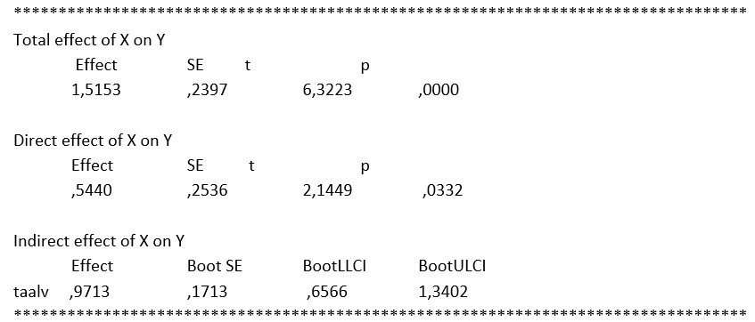

```{r, echo = FALSE, results = "hide"}
include_supplement("uu-mediation-801-nl-tabel.jpg", recursive = TRUE)
```


Question
========
  
Een psychologe onderzoekt of het effect van leeftijd op creativiteit bij kinderen verloopt via taalvaardigheid. Zij krijgt onderstaande output uit haar SPSS-analyse. 



De psychologe concludeert op basis van bovenstaande output dat het effect van leeftijd inderdaad verloopt via taalvaardigheid.  Is dit correct?
  
Answerlist
----------
* Ja, want b = 0.9713 en BCa CI [0.6566, 1.3402]
* Ja, want b = 1.5153 en t=6.3223, p=.0000
* Nee, want b = 0.9713 en BCa CI [0.6566, 1.3402]
* Nee, want b = 1.5153 en t=6.3223, p=.0000

Solution
========
Om te bepalen of er sprake is van mediatie, oftewel, om te kijken of het effect van leeftijd op creativiteit verloopt via taalvaardigheid, kijken we in de output naar het indirecte effect. In deze output kunnen we geen p-waarde aflezen, maar wel een gebootstrapt betrouwbaarheidsinterval. De nul ligt niet in dit betrouwbaarheidsinterval; het indirecte effect is dus significant. Met andere woorden: het effect van leeftijd op creativiteit bij kinderen verloopt via taalvaardigheid.   


Meta-information
================
exname: uu-mediation-801-nl.Rmd
extype: schoice
exsolution: 1000
exsection: Inferential Statistics/Regression/Multiple linear regression/Mediation
exextra[Type]: Interpretating output
exextra[Program]: SPSS
exextra[Language]: Dutch
exextra[Level]: Statistical Literacy
