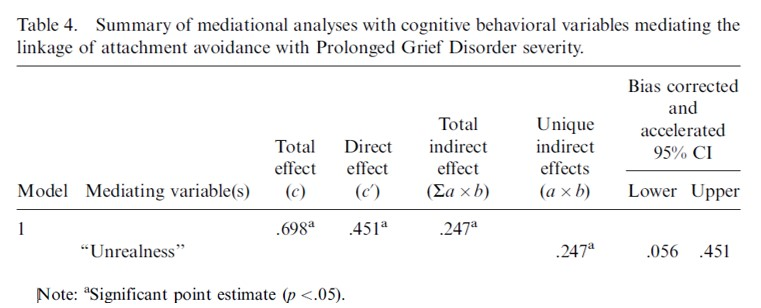

```{r, echo = FALSE, results = "hide"}
include_supplement("uu-mediation-802-nl-tabel.jpg", recursive = TRUE)
```

Question
========
  
The table below is from the article by Boelen and Klugkist (2011), Cognitive behavioral variables mediate the associations of neuroticism and attachment insecurity with Prolonged Grief Disorder



A psychologist formulates the following conclusion based on the above table: Unrealness does not fully mediate the relationship between Attachment Avoidance and PGD. Is this correct?

  
Answerlist
----------
* Yes, because the direct effect is significant
* Yes, because the total effect is significant
* No, because the total indirect effect is significant
* No, because the unique indirect effect is significant


Solution
========
The table shows that the direct effect is also significant. If the direct effect is also significant (direct effect of X on Y), there is not full mediation, but partial mediation. Thus, in this case, the effect of X on Y is not completely through the mediator.

Meta-information
================
exname: uu-mediation-802-en
extype: schoice
exsolution: 1000
exsection: Inferential Statistics/Regression/Multiple linear regression/Mediation
exextra[Type]: Interpretating output
exextra[Program]: SPSS
exextra[Language]: English
exextra[Level]: Statistical Literacy
