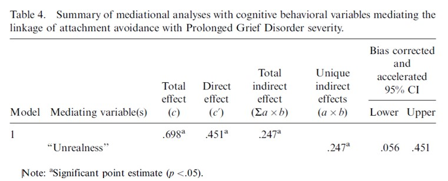

```{r, echo = FALSE, results = "hide"}
include_supplement("uu-mediation-802-nl-tabel.jpg", recursive = TRUE)
```


Question
========
  
Onderstaande tabel komt uit het artikel  van Boelen en Klugkist (2011), Cognitive behavioral variables mediate the associations of neuroticism and attachment insecurity with Prolonged Grief Disorder



Een psycholoog formuleert de volgende conclusie op basis van bovenstaande tabel: Unrealness medieert niet volledig de relatie tussen Attachment Avoidance en PGD. 
Is dit correct? 

  
Answerlist
----------
* Ja, want het directe effect is significant 
* Ja, want het total effect is significant
* Nee, want het total indirect effect is significant
* Nee, want het unique indirect effect is significant


Solution
========
In de tabel is te zien dat het directe effect ook significant is. Als het directe effect ook significant is (directe effect van X op Y), is er geen volledige mediatie, maar partiele mediatie. In dit geval verloopt het effect van X op Y dus niet volledig via de mediator.   


Meta-information
================
exname: uu-mediation-802-nl.Rmd
extype: schoice
exsolution: 1000
exsection: Inferential Statistics/Regression/Multiple linear regression/Mediation
exextra[Type]: Interpretating output
exextra[Program]: SPSS
exextra[Language]: Dutch
exextra[Level]: Statistical Literacy
