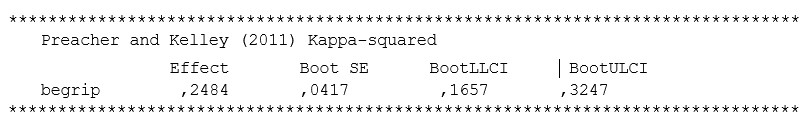

```{r, echo = FALSE, results = "hide"}
include_supplement("uu-mediation-803-nl-tabel.jpg", recursive = TRUE)
```

Question
========
  
A researcher looks at the indirect effect of age on degree of anxiety in children. He expects this relationship to be mediated by "understanding of the world. 



What should he report on the magnitude of the effect, based on the outputs below? 
Answerlist
----------
* The indirect effect is small.
* The indirect effect is medium.
* The indirect effect is large.
* No conclusion can be drawn about the size of the effect based on the above output. 


Solution
========
  
The rule of thumb says that an effect of .25 is considered large. The effect size in this example is equal to .2484, rounded is .25, and thus a large effect.

Meta-information
================
exname: uu-mediation-803-en
extype: schoice
exsolution: 0010
exsection: Inferential Statistics/Regression/Multiple linear regression/Mediation
exextra[Type]: Interpretating output
exextra[Program]: SPSS
exextra[Language]: English
exextra[Level]: Statistical Literacy
