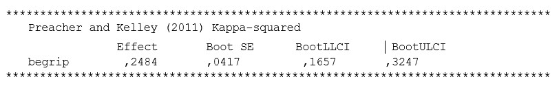

```{r, echo = FALSE, results = "hide"}
include_supplement("uu-mediation-803-nl-tabel.jpg", recursive = TRUE)
```


Question
========
  
Een onderzoeker kijkt naar het indirecte effect van leeftijd op mate van angst bij kinderen. Hij verwacht dat deze relatie gemedieerd wordt door ‘begrip van de wereld’. 



Wat moet hij rapporteren over de grootte van het effect, gebaseerd op onderstaande output?
  
Answerlist
----------
* Het indirecte effect is klein.
* Het indirecte effect is gemiddeld.
* Het indirecte effect is groot. 
* Er is geen conclusie te trekken over de grootte van het effect op basis van bovenstaande output. 


Solution
========
  
De vuistregel zegt dat een effect van .25 als groot wordt gezien. De effectgrootte in dit voorbeeld is gelijk aan .2484, afgerond  is dit .25, en dus een groot effect. 

Meta-information
================
exname: uu-mediation-803-nl.Rmd
extype: schoice
exsolution: 0010
exsection: Inferential Statistics/Regression/Multiple linear regression/Mediation
exextra[Type]: Interpretating output
exextra[Program]: SPSS
exextra[Language]: Dutch
exextra[Level]: Statistical Literacy
